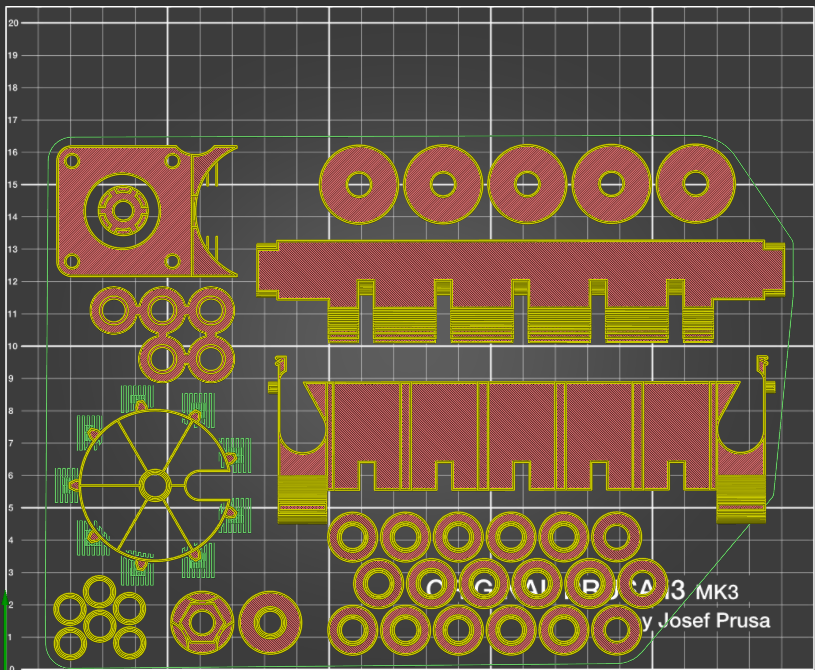
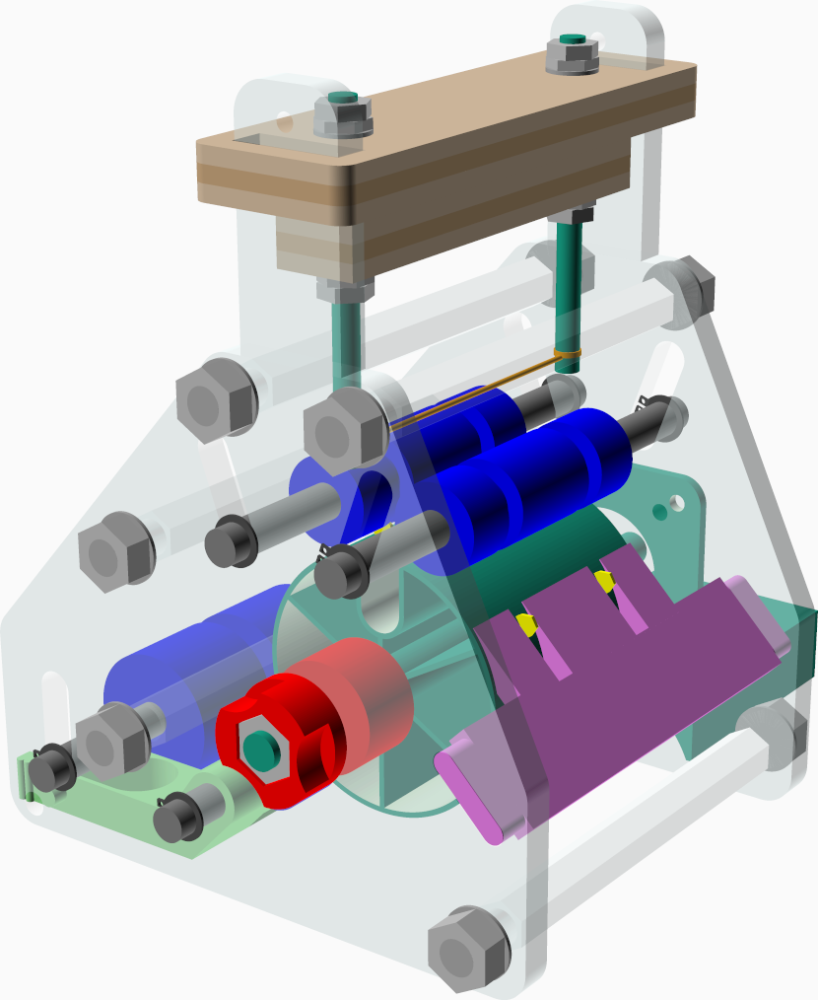

# Hot Knife cutting machine for synthetic button-hole bands

*Work in Progress*

Here at [MakerNexus], we're now producing the [Covid-19 effort][FaceShields]
face-shield parts via injection-molding, so now one bottleneck is to cut
enough elastic bands, which at this point happens entirely by hand.

This device helps to cut button-hole elastic.

It is specialized to work with the particular band we have in width
and button-hole distance; it cuts exactly the length we need (18 holes apart,
just between the holes). Changes in these specifications can easily be
adapted with the parametric CAD model.

This machine is for that, a hot knife (really at this point: hot wire) cutter
that allows to cut multiple parallel bands at once.

[](http://www.youtube.com/watch?v=dfniXM3w2Yc "Animation")

## Manufacturing
Most items can be entirely 3D printed, the side panels and wooden handle
is laser cut. To generate manufacturing outputs with OpenSCAD, type `make`.

### 3D printing
The provided fab/band-cutter-machine.3mf file contains a print layout that
provides all the parts needed to print a machine that can cut two bands in
parallel.

#### Changing parallel bands
By default, the stack of bands that is cut in parallel is two, but that
can be changed with a parameter. A machine that can cut up to 5 bands in
parallel can fit on a Prusa MK3 bed.

```bash
make BAND_STACK=5  # to build the new artifacts; here we want 5 bands
cd fab/            # because prusa-slicer 3MF does not handle relative paths...
prusa-slicer band-cutter-machine.3mf
# Now, press F5 in the UI for reload.
```

There seems to be a bug in prusa-slicer which then slightly mis-aligns the
cylinder support enforcer around the main wheel; adjust that first before
slicing.

 Two band wide                      | Five band wide
------------------------------------|------------------------------------
 | 

The side-panels take a lot of time to print, so we laser-cut these (but
you can also print `fab/mount_panel.stl` if in a pinch and don't have access
to a laser cutter).

### Laser Cutting

There are two files, provided as DXF format that need to be laser-cut.

  * `fab/laser_cut_knife_slider.dxf` Needs to be cut from 3mm plywood.
  * `fab/laser_cut_mount_panel.dxf` can be wood, but ideally transparent
    acrylic to inspect the inside of the machine.

 Knife Slider (plywood, 3mm)        | Mount Panel (acrylic, 6mm)
------------------------------------|------------------------------------
 | 

## Assembly

Parts fit together pretty straightforward, check out the rendering and
picture below. Note that the spacing tubes for the axles come in two sizes:
the ones around the in-feed idler with the big wheels are slightly longer than
the other idler axes.

As 'axles', I am using easy-to-get threaded rods, cut to length (whatever
is easy to get; 6mm or 1/4").
All idler-axles should be held in place by retaining rings (I don't have any
right now, so this is why it is temporarily using nuts).

The center wheel is driven by a stepper motor, mounted on one side of the
panel. There is a meshing coupler that drives the wheel. Since the motor
axle is not long enough to go all the way through the machine, there is a
floating axle on the opposing side that is mounted firmly perpendicular to
the panel with flat nuts with a large surface.

The hot wire is mounted between two threaded rods (#8, about 4.2mm), held
apart by a wooden block made up of a couple of layers laser-cut plywood. That
way, that part does not soften over time near the rods that get warm in
operation.

Put aluminum sticky tape inside the wheel channel.


 Render                     | Assembled (older model)
----------------------------|-----------------------
 | 


## Usage

Loading the band requires it to go around the lower idler, then around the
central wheel and emerging at the top.

In order to get it through the in-feed tray and under the lower idler, it
is possible to unlatch the infeed-tray and rotate so that this can be done
with the least amount of fiddling.

 Feeding with opened loading tray        | Closed back up
-----------------------------------------|----------------
             | 

Now, wrap around the button elastic half way around the big wheel, then
under the top idlers (that can be moved up manually. In this picture purple
and red) so that the elastics emerge at the front; we're now fully loaded:


### License

This is shared with the Creative Commons Attribution-ShareAlike [CC-BY-SA]
license.

[MakerNexus]: https://makernexus.com/
[FaceShields]: https://www.covidshieldnexus.org/
[CC-BY-SA]: https://creativecommons.org/licenses/by-sa/4.0/